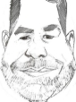
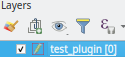
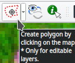
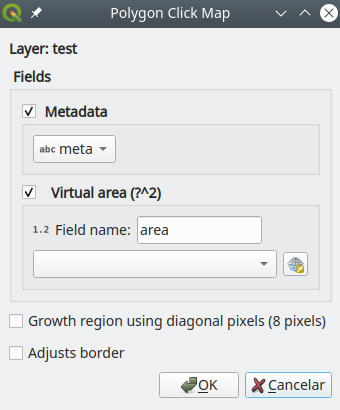
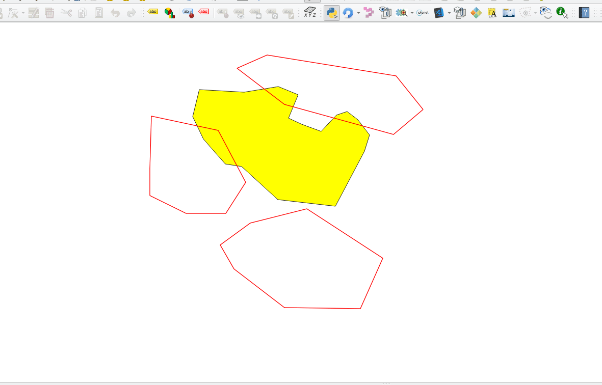
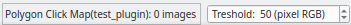
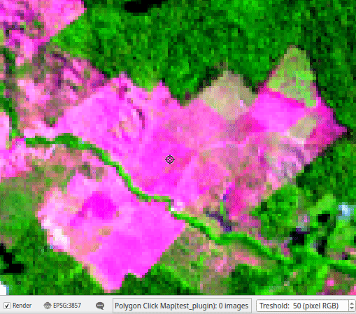

  

# Polygon Click Map Plugin  
 ***Polygon Click Map*** makes it easy to create polygon from image in map.  

The ***Polygon Click Map*** is a tool plugin that permit get a delimitation of area inside the image on map.  
The user clicking inside the region, the tool create automatically the limit of region.  

## Dependences:  
* [SciPy](https://www.scipy.org/install.html) . The QGIS install SciPy for Mac and Windows.  

## Steps:

* **Select a polygon layer editable for actived the tool:**  
 ----------> 
* **Setup:**  
  ---------->   
  * Fields:
    * Metadata:
      * List the exists text fields.
      * The selected field must have a length that is able to receive metadata from plugin.
      * The plugin populate this field with JSON format with keys:
        * rasters: List of visible raster layers.
        * user: The user of QGIS.
        * datetime: The datetime when poligonize the regions.
        * scale: Scale of map when poligonize the regions.
      * Populate the field if the group is selected.
    * Virtual area:
      * The virtual field with expression that calculate area.
      * Select the projected CRS (linear unit).
      * Create virtual field if the group is selected.
  * Adjusts border:
      * If selected, it will adjust the borders between the polygons after poligonize of regions.
  
      * The most recent polygon will have the overlap areas cut off, and, the gap area added to its.

* **Using the tool:**    
  * Must have a visible raster layer on the map.
  * When the tool is active, the QGIS status bar has the box for the threshold used to calculate the growth region. 
  * When click in image of map, the tool will be create a growth region from this point until the neighbors pixels of image that have values greater than threshold.  
  
  * New regions can be do clicking in the others places of the image.
  * Can change the threshold while creating the region, clicking and dragging with mouse. Right or up, the threshold increases, otherwise, the threshold decreases.  
  
  * With the right mouse button, can hide or show the regions.  
    

  * Keyboard keys:
    * D: Delete the last region.
    * U: Undoing the last deletion.
    * F: Fill holes inside the regions.
    * C: Clear regions.
    * P: Poligonize regions. * Create the polygons.
    * H: Help,press and keep hold for reading.
    
## Donation is well come.  
International (only PayPal)
 From Brazil  Key: motta.luiz@gmail

