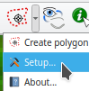

  

# Polygon Click Map Plugin  
 ***Polygon Click Map*** torna fácil criar polígonos a partir da imagem no mapa.  

O ***Polygon Click Map*** é um plugin do tipo ferramenta que permite obter a delimitação de uma área dentro de uma imagem no mapa.  
O usuário clicando dentro de uma região, a ferramenta cria automaticamente o limite da região.  

## Dependências:  
* [SciPy](https://www.scipy.org/install.html) . O QGIS instala SciPy para o Mac e windows.  

## Passos:

* **Selecionar uma camada do tipo polígono editável para ativar a ferramenta:**  
 ----------> 
* **Setup:**  
  ---------->   
  * Campos:
    * Metadado:
      * Lista os campo do tipo textos existentes.
      * O campo selecionado deve ter um tamanho que seja capaz de receber o metadado a partir do plugin.
      * O plugin popula esse campo com o formato JSON com as chaves:
        * rasters: Lista as camadas do tipo imagem visíveis.
        * user: O usuário do QGIS.
        * datetime: A data e hora quando poligonalizou as regiões.
        * scale: Escala do mapa  quando poligonalizou as regiões.
      * Popula o campo se o grupo estiver selecionado.
    * Área virtual:
      * O campo virtual com a expressão que calcula a área.
      * Selecionar o SCR projetado (unidade linear).
      * Cria o campo virtual se o grupo estiver selecionado.
  * Adjuste de borda:
      * Se selecionado, irá ser ajustadas as bordas entre os polígonos após a poligonalizaçãop das regiões.
  
      * O polígono mais recente irá ter suas áreas de sobreposição cortadas, e, os espaços entre as bordas adicionádos a ele.

* **Usando a ferramenta:**    
  * Deverá ter uma camada do tipo imagem visível no mapa.
  * Quando a ferramenta é ativada, a barra de status do QGIS terá uma caixa para a tolerância usada no cálculo da região de crescimento. 
  * Quando clica no mapa, a ferramenta irá criar a região de crescimento a partir do ponto, até os pixeis vizinhos da imagem que tem valores maior que a tolerância.  
  
  * Novas regiões podem ser feitas clicando em outros lugares da imagem.
  * Pode mudar o valor da tolerância enquanto cria a região, clicando e arrastando com o mouse. Direita ou acima, a tolerância aumenta, caso contrário, diminui.  
  
  * Com o botão direito do mouse, pode mostrar ou ocultar as regiões.  
    

  * Keyboard keys:
    * D: Deleta a última região.
    * U: Desfaz a última deleção.
    * F: Preenche os buracos dentro das regiões.
    * R: Remove todas as regiões.
    * P: Poligonaliza as regions. * Criação dos polígonos.
    * H: Ajuda, pressiona e mantenha pressionado para lêr..
    
## Doações são bem vindas.  
Internacional (apenas PayPal)
 No Brasil  Chave: motta.luiz@gmail